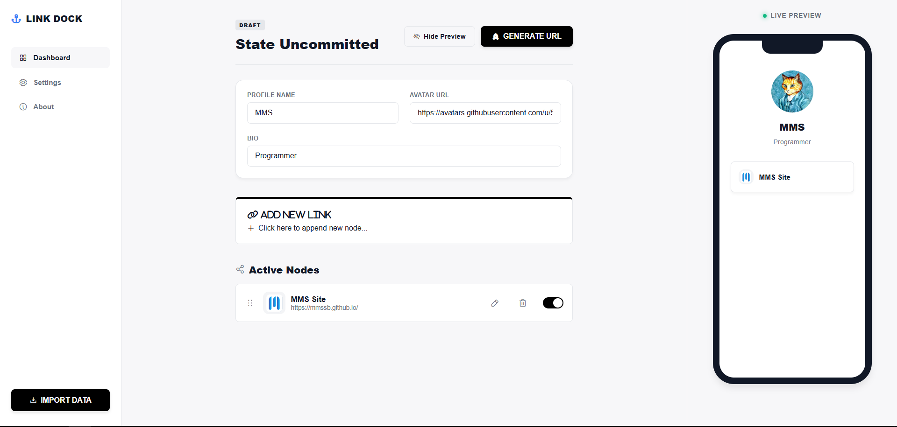

# ⚓ Link Dock

**Link Dock** is a 100% serverless, zero-backend "Link in Bio" builder. 

Instead of relying on a traditional database or backend server to store your profile data, Link Dock compresses your entire configuration (links, bio, profile name, and UI state) into a secure, base64-encoded string embedded directly inside your custom URL. **Your URL *is* your database.**



## ✨ Features

- **Zero-Backend Architecture:** Host it anywhere for free (GitHub Pages, Vercel, Netlify). No databases, no user accounts, no API limits.
- **Dynamic Auto-Favicons:** Simply paste a URL, and Link Dock automatically scrapes and fetches the high-resolution favicon for that exact page or domain.
- **Hybrid Responsive UI:** - *Desktop:* Beautiful 3-column layout with HTML5 drag-and-drop sorting and a collapsible live preview.
  - *Mobile:* Native app feel with smooth bottom-sheet modals, 3-dot action menus, and bottom navigation.
- **State Import/Export:** Easily paste your generated long-URL back into the builder at any time to instantly restore and edit your profile.
- **Universal Theming:** Instant switching between Light, Dark, and System Default modes using CSS variables and LocalStorage persistence.

## 🚀 How it Works

1. **Build:** Open `index.html` in your browser. Add your links, avatar URL, and bio.
2. **Deploy:** Click **Deploy Portal**. The JavaScript Engine bundles your data, stringifies it, encodes it, and generates a massive custom URL.
3. **Share:** You copy the generated URL. Whenever someone clicks it, the app detects the encoded parameter, decodes it on the fly, and renders your public profile instantly.

## 🛠️ Tech Stack

Link Dock is incredibly lightweight and built strictly with native web technologies.
- **HTML5** (Semantic structuring)
- **CSS3** (Variables, Flexbox/Grid, Hardware-accelerated Cubic-Bezier animations)
- **Vanilla JavaScript** (ES6, DOM manipulation, Base64 encoding/decoding)
- **Icons:** Phosphor Icons, FontAwesome, and RemixIcon.

## 📁 File Structure

```text
link-dock/
├── index.html       # The main builder and public viewer logic
├── settings.html    # UI configuration (Dark/Light mode)
├── about.html       # System architecture info
├── style.css        # Universal stylesheet and responsive layouts
├── script.js        # Core logic engine, DOM updates, and encoding
└── settings.js      # LocalStorage theme management
